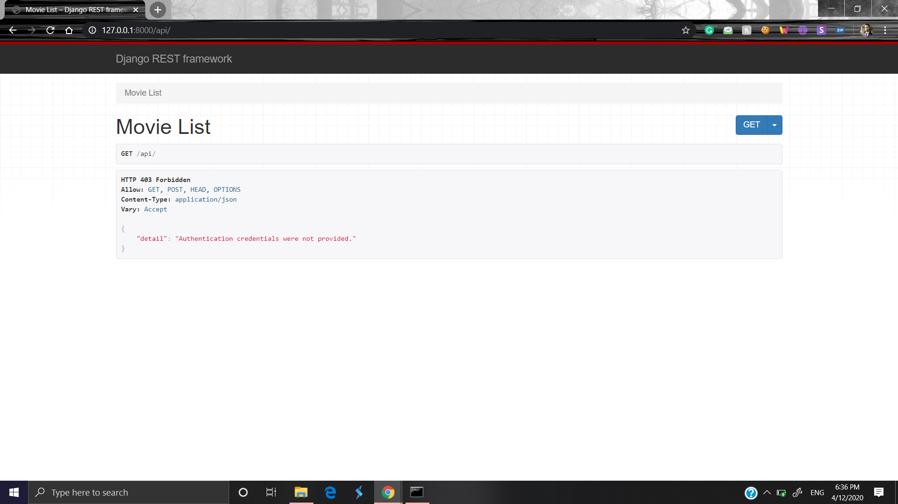
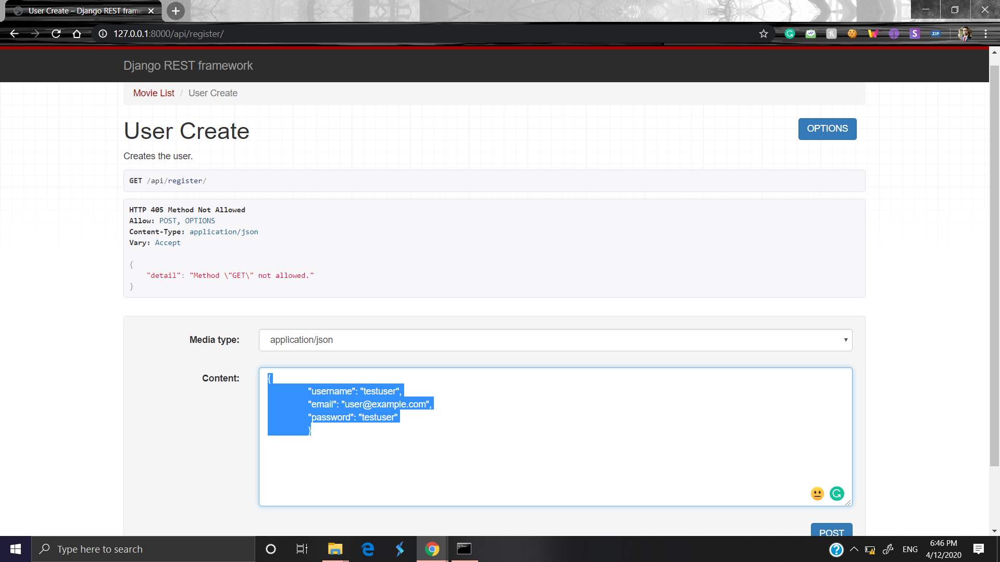
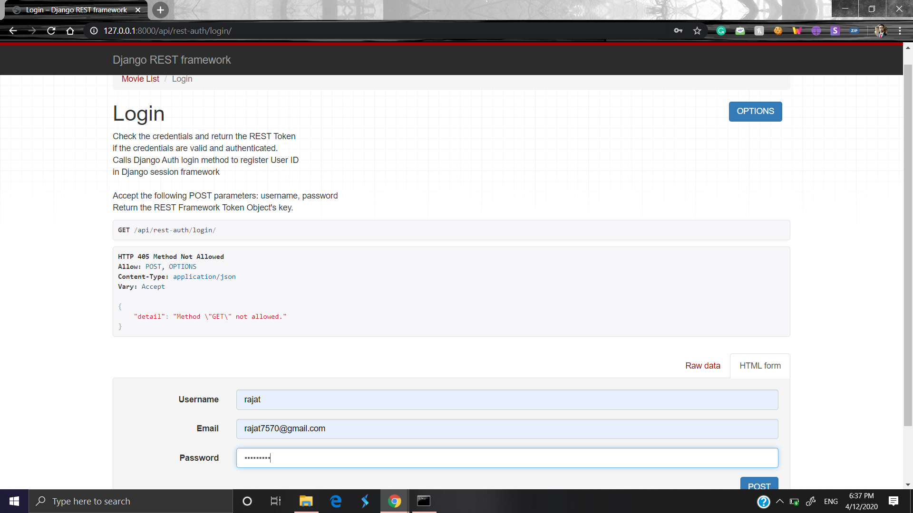
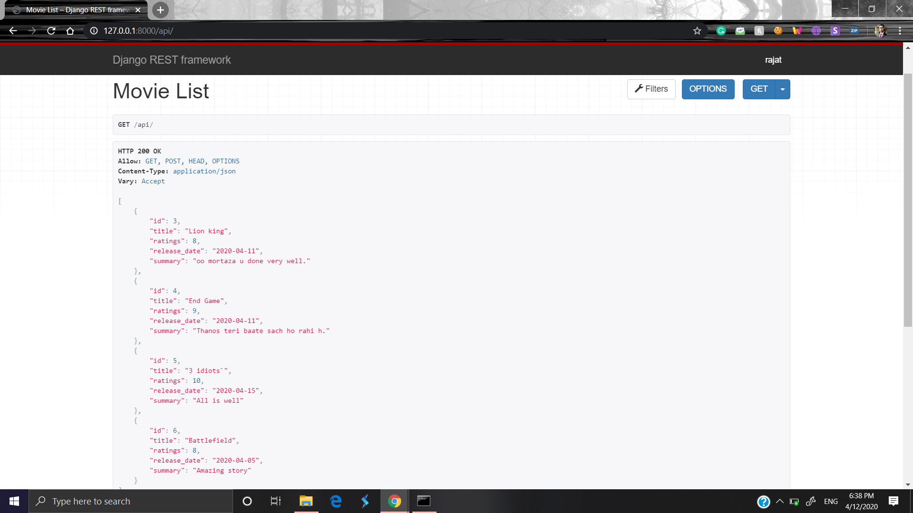
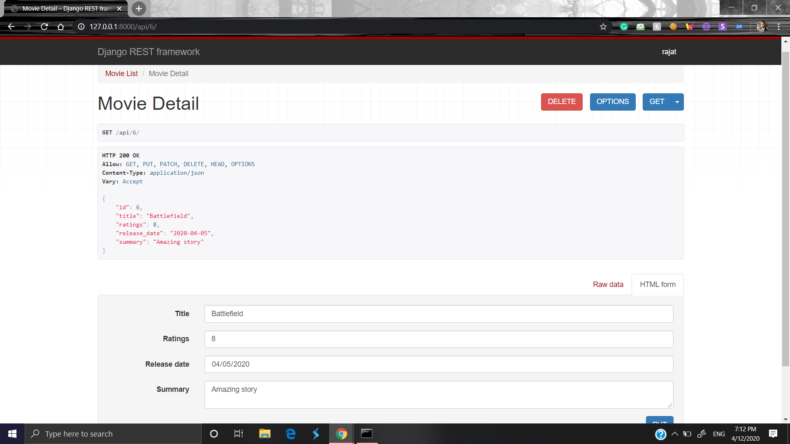
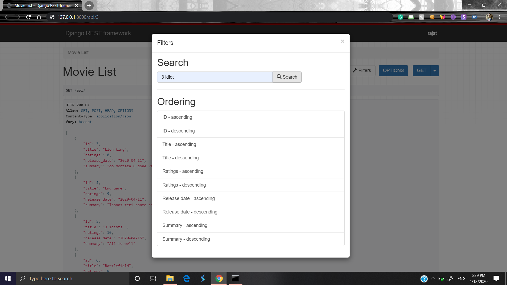
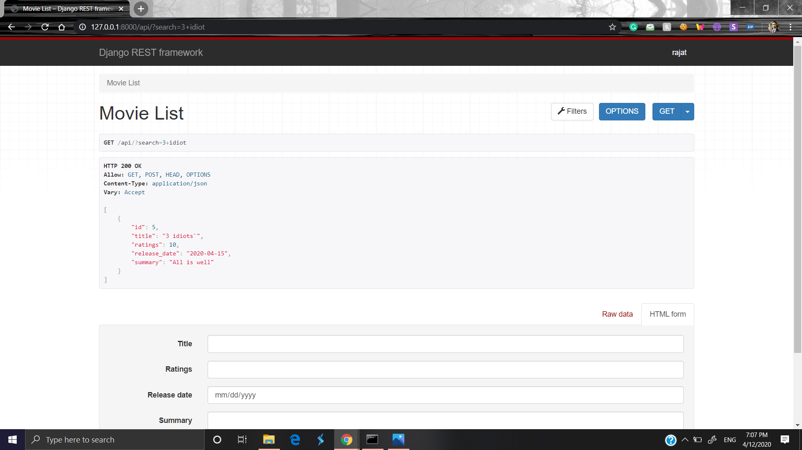

# Movie_rest_api  
## Movie detail rest api.
Some key points:
  * Built using django rest framework
  * Movie data api. 
  * Need login to view api data.
  * User registration
  * searching the movies based on title
  * detail info of each movie
  * authenticate user can perform CRUD operation easily.  
  
To start the api on your local server 
  
   * open command prompt and go to project directory
   * turn on the virtual environment
      > myvenv\Scripts\activate
   * migrate the data
      > python manage.py makemigrations
      
      > python manage.py migrate
   * run the server
      > python manage.py runserver

### User visit api http://127.0.0.1:8000/api/

### User Registration  http://127.0.0.1:8000/api/register/
  
### After successful registration  

### User Login to api        http://127.0.0.1:8000/api/rest-auth/login/
  
### Now data in api are visible and user can see all data and can post new data to existing data  http://127.0.0.1:8000/api/
 
### Accessing indivisual data and can perform update and delete operation  http://127.0.0.1:8000/api/6/

### Search movie title  click on filter button to search
  
  
### Logout 

